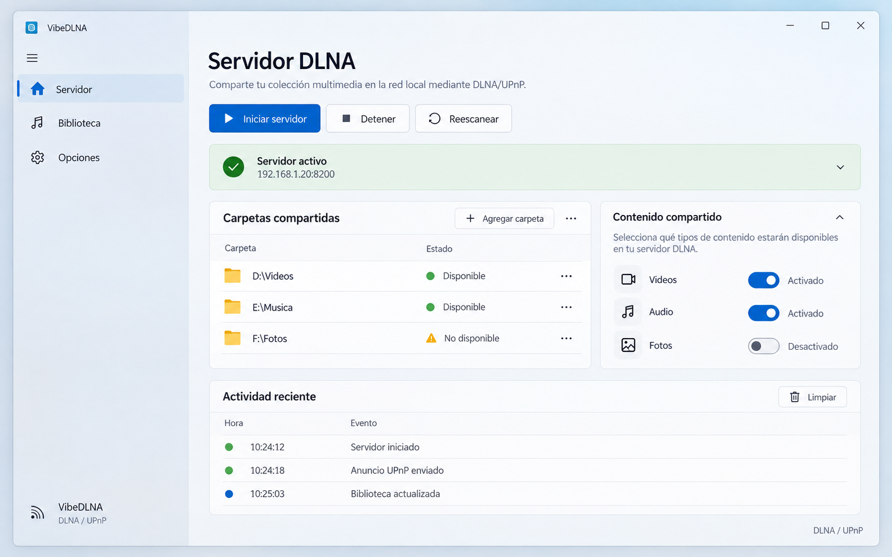

# VibeDLNA · WinUI 3 desde referencias enlazadas

Mockup visual creado desde cero usando como referencias de diseño únicamente los cuatro repositorios proporcionados:

- [microsoft-ui-XAML](https://github.com/microsoft/microsoft-ui-XAML)
- [win-dev-skills](https://github.com/microsoft/win-dev-skills)
- [WinUI-Gallery](https://github.com/microsoft/WinUI-Gallery)
- [WinUI-3-Apps-List](https://github.com/jishnu-kv/WinUI-3-Apps-List)

## Elementos representados

- `NavigationView` lateral con `Servidor`, `Biblioteca` y `Opciones`.
- CommandBar con iniciar, detener y reescanear.
- `InfoBar` de estado activo y endpoint de red.
- `ListView` de carpetas compartidas.
- `ToggleSwitch` para vídeos, audio y fotos.
- Panel de actividad reciente con estilo de herramienta de escritorio.
- Superficie clara tipo Mica, jerarquía Fluent y espaciado consistente.

Es una referencia visual de diseño, no una implementación XAML ni una migración funcional de la aplicación.
